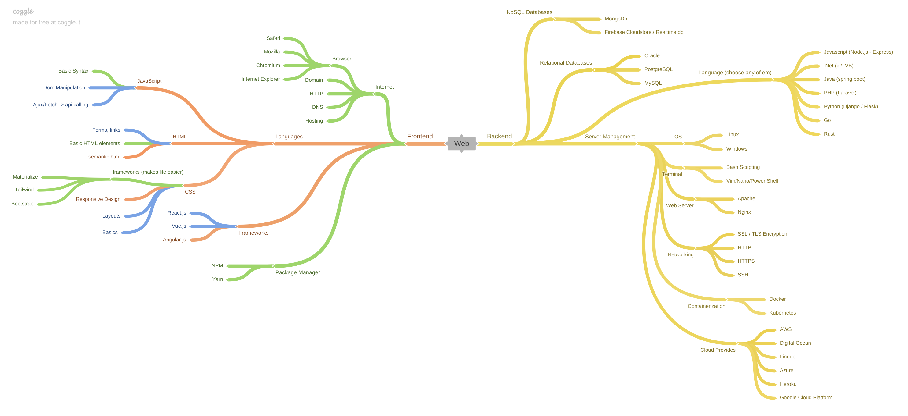

# How to become a web developer in 2021

below there is an image that has a few tools/technologies/frameworks to learn to be a web dev in 2021


# Resources

In the folders there will be resources to learn a tool/technology .
Feel free to create issues and contribute to these resource folders and also to the roadmap.

# Contribution Guide

- Fork this repository
- Clone Locally on your machine
- Create a branch from git bash or powershell (you can also use github web app/cli)

```
git branch new_branch
```

- Switch to the branch

```
git checkout new_branch
```

- Add Links to the resources folder on the readme file. (if doesn't exist, create one)
- Create improvised web.png and replace it with the existing one
- Make Changes and Add those Changes

```
git add .         // to add all files in the directory
git add file_name // to add a particular file
```

- Commit those changes

```
git commit -m "Commit Message"
```

- Push to your forked repo

```
git push origin new_branch
```

- Submit your Changes for review. if you go to github you will see a Compare & pull request button. Click on that.
